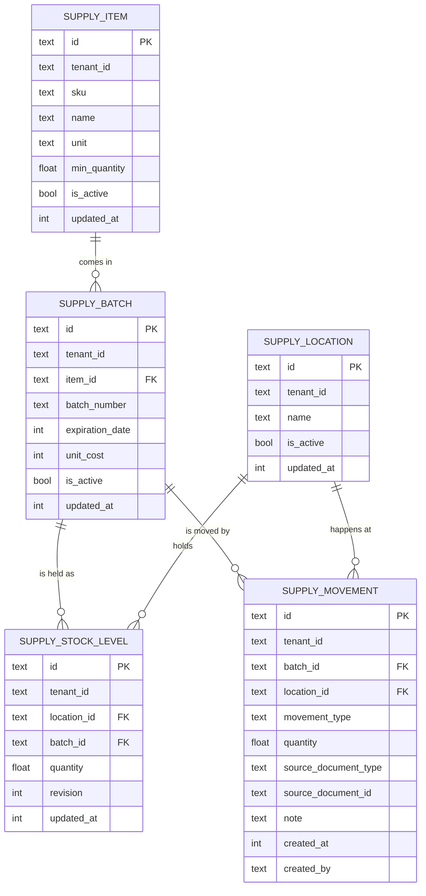

# Database

```mermaid
erDiagram
    SUPPLY_ITEM ||--o{ SUPPLY_BATCH : "comes in"
    SUPPLY_BATCH ||--o{ SUPPLY_STOCK_LEVEL : "is held as"
    SUPPLY_LOCATION ||--o{ SUPPLY_STOCK_LEVEL : "holds"
    SUPPLY_BATCH ||--o{ SUPPLY_MOVEMENT : "is moved by"
    SUPPLY_LOCATION ||--o{ SUPPLY_MOVEMENT : "happens at"
    SUPPLY_ITEM {
        text id PK
        text tenant_id
        text sku
        text name
        text unit
        float min_quantity
        bool is_active
        int updated_at
    }
    SUPPLY_LOCATION {
        text id PK
        text tenant_id
        text name
        bool is_active
        int updated_at
    }
    SUPPLY_BATCH {
        text id PK
        text tenant_id
        text item_id FK
        text batch_number
        int expiration_date
        int unit_cost
        bool is_active
        int updated_at
    }
    SUPPLY_STOCK_LEVEL {
        text id PK
        text tenant_id
        text location_id FK
        text batch_id FK
        float quantity
        int revision
        int updated_at
    }
    SUPPLY_MOVEMENT {
        text id PK
        text tenant_id
        text batch_id FK
        text location_id FK
        text movement_type
        float quantity
        text source_document_type
        text source_document_id
        text note
        int created_at
        text created_by
    }
```
